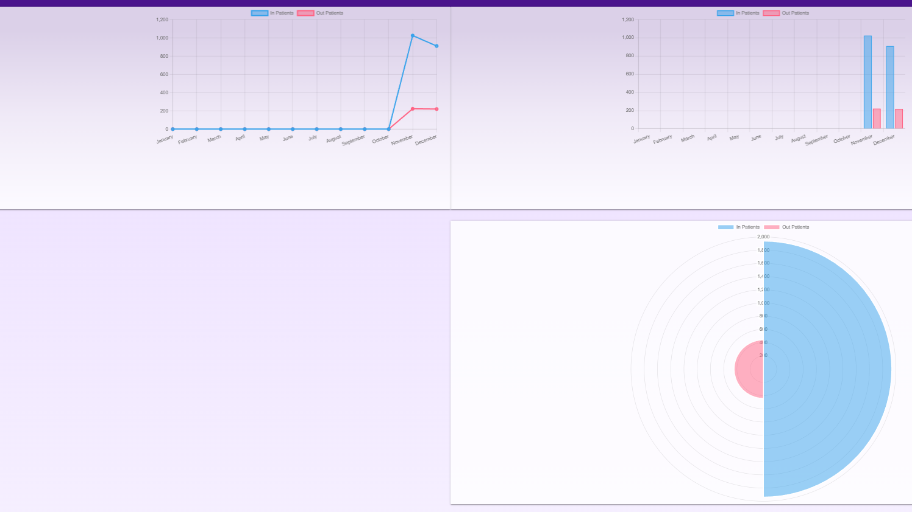

# Hospital Information System (HIS)

A comprehensive **Hospital Information System** managing **internal and external visits, room allocations, medical equipment, inventory, accounting, patient payments, and dashboards** for hospital administrators.

---

## Overview
**Industry:** Healthcare  
**Role:** Principal Software Engineer & Backend Architect  
**Users:** Doctors, Nurses, Administrative Staff, Finance Team, Hospital Management  

### Business Problem
Hospitals struggled with:  
- Fragmented management of patient visits (inpatient & outpatient)  
- Poor tracking of rooms, beds, and medical equipment  
- Inefficient inventory and store management  
- Manual accounting and payment tracking  
- Lack of consolidated dashboards for decision-making  

---

## Key Features
- **Patient Management:** Internal (inpatient) and external (outpatient) visits  
- **Room & Equipment Management:** Room allocation, bed tracking, and medical equipment status  
- **Inventory & Store:** Stock management for consumables, medicines, and supplies  
- **Accounting & Payments:** Patient payments, billing, insurance tracking, and financial reporting  
- **Dynamic Dashboards:** Overview of patient flow, occupancy rates, revenue, and inventory levels  
- **Role-Based Access:** Doctors, nurses, finance, and admin staff  

---

## Architecture & Technologies
- **Backend:** Django, Django REST Framework (DRF)  
- **Async Tasks:** Celery + Redis (notifications, report generation, background processes)  
- **Databases:** MySQL (structured data), MongoDB (unstructured medical records)  
- **Frontend:** Vue.js + Bootstrap (dashboard & admin interfaces)  
- **Infrastructure / Deployment:** AWS EC2, S3, RDS  
- **CI/CD:** Docker, GitHub Actions  

 
---

## Key Achievements
- Built **comprehensive HIS** integrating patient management, rooms, equipment, and inventory  
- Designed **real-time dashboards** for hospital occupancy, patient flow, and revenue  
- Implemented **automated accounting and payment workflows**  
- Developed **role-based access control** ensuring compliance with privacy and operational protocols  
- Optimized **inventory and store management** for consumables and medical supplies  

---

## Impact
- Centralized management of internal & external patient visits  
- Streamlined hospital operations across multiple departments  
- Improved financial tracking and reporting for patient payments and hospital revenue  
- Scalable system for multi-department hospitals with real-time dashboards  

---

## Screenshots / Demo
>   
> *Placeholder for HIS dashboard screenshot*

---

## Note on Source Code
This project is enterprise-grade and protected under NDA.  
Source code cannot be shared publicly, but architecture, workflows, and system design are available for discussion.

---

## Contact
📧 ahmedbarakatsamra@gmail.com  
🔗 [LinkedIn](https://www.linkedin.com/in/ahmed-barakat-8b7b9922/)  
🔗 [GitHub](https://github.com/ahmedbarkat)
